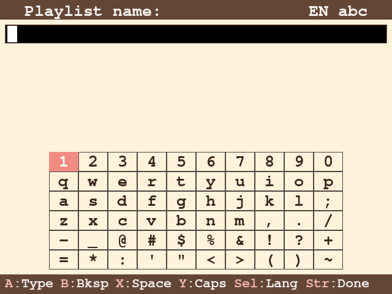

# BubuOS

A cute pocket operating system built with love for the [GPi Case 2](https://retroflag.com/gpi_case_2.html).

BubuOS is a custom DOS-like shell for Raspberry Pi CM4, written in Python + pygame. It runs on a 640x480 DPI LCD with 10-button gamepad input — no keyboard, no mouse, no touchscreen. Just a tiny console in your pocket.


## Features

- **File Browser** — navigate folders, open files, delete with confirmation
- **Music Player** — plays MP3/FLAC/OGG with animated Bubu sprites and progress bar
- **Weather** — current weather and 5-day forecast with cute Bubu in seasonal outfit
- **Calendar** — month view with events organizer, to-do checkmarks
- **Snake** — classic snake game where Bubu eats burgers
- **Text Editor** — on-screen QWERTY keyboard for notes
- **Web Radio** — internet radio player
- **Image Viewer** — full-screen image viewer with folder navigation
- **Bluetooth Audio** — pair and connect BT speakers
- **WiFi Manager** — scan and connect to networks
- **System Info** — CPU, RAM, storage, network, temperature
- **Sound Effects** — procedurally generated music-box UI sounds
- **Screenshots** — capture the screen with a button press

## Screenshots

| Files | Apps | Weather |
|-------|------|---------|
|  |  |  |

| Music Player | Calendar | Snake |
|-------------|----------|-------|
|  |  |  |

| Keyboard | Playlist |
|----------|----------|
|  |  |

## Hardware

- [GPi Case 2](https://retroflag.com/gpi_case_2.html) — the shell (screen + buttons + battery)
- [Raspberry Pi CM4 Lite](https://www.raspberrypi.com/products/compute-module-4/) — 2GB RAM, Wireless
- microSD card (any size, 8GB+ recommended)

## Stack

- Raspberry Pi OS Lite (Debian 13, no desktop)
- Python 3 + pygame 2 (SDL2)
- X11 via `xinit` (not kmsdrm — due to a vc4-fkms-v3d async page flip bug)
- PipeWire + WirePlumber for Bluetooth audio
- Systemd service for auto-start

## Install

### Preparing the SD card

1. Download [Raspberry Pi Imager](https://www.raspberrypi.com/software/)
2. Choose **Raspberry Pi OS Lite (64-bit)** (no desktop)
3. Click the gear icon (settings) before flashing:
   - Set **hostname** (e.g. `bubuos`)
   - **Enable SSH** (password authentication)
   - Set **username and password** — you'll need these to connect
   - **Configure WiFi** — required for installation (GPi Case 2 has no Ethernet)
4. Flash to microSD card and insert into GPi Case 2

### Quick setup (recommended)

1. Boot the Pi and connect via SSH:
   ```bash
   ssh <your-username>@<hostname>.local
   ```
2. Clone this repo:
   ```bash
   git clone https://github.com/xtwoitx/bubuos.git ~/bubuos
   ```
3. Run the setup script (use your username):
   ```bash
   sudo bash ~/bubuos/setup/setup.sh <your-username>
   ```
4. Reboot:
   ```bash
   sudo reboot
   ```

BubuOS will start automatically on boot. Use the built-in WiFi Manager app to connect to your network.

### Manual setup

1. Flash **Raspberry Pi OS Lite (64-bit)** to a microSD card
2. Copy the `bubuos/` directory to `/home/<user>/bubuos/`
3. Install dependencies:
   ```bash
   sudo apt install python3-pygame xserver-xorg-core xinit \
       libsdl2-dev libsdl2-mixer-dev libsdl2-ttf-dev libsdl2-image-dev \
       pipewire pipewire-pulse wireplumber libspa-0.2-bluetooth \
       network-manager bluez bluez-tools \
       mpv surf xdotool
   ```
4. Allow non-root X server:
   ```bash
   echo -e "allowed_users=anybody\nneeds_root_rights=yes" | sudo tee /etc/X11/Xwrapper.config
   ```
5. Install the systemd service (replace `<user>` with your username):
   ```bash
   sed "s/YOUR_USER/<user>/g" setup/bubuos.service | sudo tee /etc/systemd/system/bubuos.service
   sudo systemctl enable bubuos
   sudo reboot
   ```

## Troubleshooting

### Black screen after boot / display not working

The GPi Case 2 uses a DPI LCD that requires `vc4-fkms-v3d` overlay. **Do not use `vc4-kms-v3d`** (full KMS) — it does not support the DPI display.

Check `/boot/firmware/config.txt`:
```
dtoverlay=vc4-fkms-v3d
```

BubuOS also disables HDMI output at startup to avoid conflicts with the DPI display. If you see output on HDMI instead of the built-in screen, this is handled automatically.

### Buttons / gamepad not responding

The GPi Case 2 buttons are mapped as a USB gamepad. The BubuOS service must start **after** `multi-user.target` to ensure the USB gamepad is ready. If you see `KeyError` or `SystemError` in logs related to joystick, check:
```bash
journalctl -u bubuos --no-pager -n 30
```
Make sure the service file has `After=multi-user.target` (not `sysinit.target`).

### No sound

BubuOS uses `SDL_AUDIODRIVER=alsa` by default. Sound effects are generated procedurally (no audio files needed). For Bluetooth speaker audio:

1. Open the **Bluetooth** app in BubuOS to pair your speaker
2. PipeWire/WirePlumber handle Bluetooth audio routing automatically
3. A2DP profiles need ~10 seconds to register after boot — if Bluetooth connection fails, wait and retry
4. **Do not restart PipeWire/WirePlumber** while a BT device is connected — it will disconnect

### WiFi not connecting

WiFi configured in Raspberry Pi Imager is used for the initial SSH setup. After BubuOS is installed, you can manage WiFi through the built-in **WiFi Manager** app. If WiFi stops working:
```bash
sudo nmcli device wifi list
sudo nmcli device wifi connect "SSID" password "password"
```

### SDL2 / pygame crashes with page flip errors

This is a known bug in `vc4-fkms-v3d` + SDL2: the driver reports `DRM_CAP_ASYNC_PAGE_FLIP=1` but rejects async flips. BubuOS works around this by using **X11** (`SDL_VIDEODRIVER=x11`) instead of kmsdrm. The setup script configures this automatically.

### Coil whine / high-pitched noise from GPi Case 2

This is a known hardware issue with the GPi Case 2 — the voltage regulators can produce audible coil whine, especially when the display is active. It is not caused by BubuOS. Some units are worse than others. There is no software fix, but connecting a Bluetooth speaker masks it.

## The Story

It started with the form factor. The GPi Case 2 looks like a Game Boy, and after years of using a Nintendo Switch I was already comfortable with gamepad-only interfaces — limited buttons, no mouse, no keyboard. I wanted to turn it into a tiny pocket computer.

I first installed a DOS-like system with Norton Commander, but it became obvious quickly — traditional TUIs are designed for 80×25 terminals, not a 640×480 LCD with a D-pad. Everything was too small, too dense, too fiddly. So I decided to write my own shell from scratch, using SDL2 (via pygame) for pixel-perfect control over every element on that tiny screen.

Bubu and Dudu are characters that are very popular in my family — they genuinely helped soften a rough period of depression. Combining them with the GPi Case felt natural: they became the mascots of the pocket computer, living inside it, playing music, checking the weather, and eating burgers. Building a home for them turned into a project that brought me back to life.

## License

MIT
